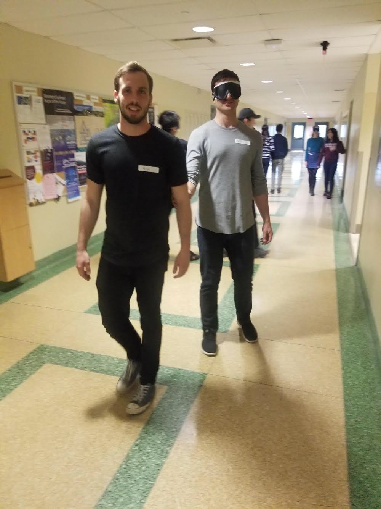

## Overview

A day for engineering students to learn about blindness. 

## The teams 

As a researcher in software for the blind, I also worked pro-bono with a handful of final year engineering students who are interested in developing similar applications. Their projects focused on two sectors of navigation, physical and cyber.

Two teams focused on physical navigation creating tools for blind indivduals to utilize when walking indoors.

Another team focused on cyber navigation reimagining the way blind book readers read books. Their motivation came from the SerpUI application I developed in my research.

Source: Guy Meyer

## Guide Day

In order to connect students with their end-user I felt it was necessary to recruit field experts and blind individuals to participate in activities and Q&A with the students. We had a day full of O&M (mobility) drills and a panel for discussion.

The lessons learned by our students filled them motivation and a new perspective on how to approach these unique engineering problems.

Source: Guy Meyer

Source: Guy Meyer

Thank you Valerie Kitazaki, Ka Li, and Rachel (from W. Ross) for taking your time to share your experiences with our students!

